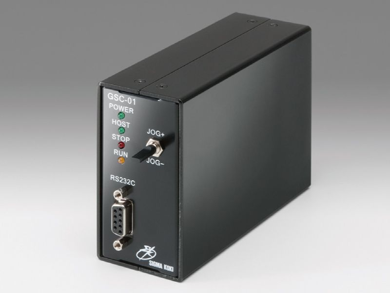

# GSC-01

## Controller
- OptoSigma, Single axis Stage Controller (GSC-01) [[Web]](https://jp.optosigma.com/en_jp/motorized-stages/controllers-drivers/single-axis-stage-controller/gsc-01.html) [[Manual]](https://jp.optosigma.com/html/en_jp/software/motorize/manual_en/GSC-01_En.pdf)




## Usage
### Initialize Connection
```python
from optosigma import GSC01
port = "/dev/tty.usbserial-FTRWB1RN"
controller = GSC01(port)
```
### Reset
Return to mechanical origin.
```python
controller.return_origin()
controller.sleep_until_stop()
```

### Set and Get Stage Position
Member variable `position` is linked to the position of the stage.
```python
print(controller.position)  # Get stage position
controller.position = 500    # Move position to 500
controller.sleep_until_stop()
controller.position += 1000   # Move stage to +1000 [pulse] from current position
controller.sleep_until_stop()
```

## Relationship Between Commands and Methods
| Command | Character | Methods |
| --- | ---| --- | 
| Return to mechanical origin | H: | return_origin() |
| Set Relative Move pulse count | M: | set_relative_pulse(pulse) |
| Set Absolute Move pulse count | A: | set_absolute_pulse(pulse) |
| JOG command | J: | jog(direction) |
| Drive command | G: | driving() |
| Deceleration and stop | L: | decelerate_stop() |
| Stop | L:E | immediate_stop() |
| Set electronic (logical) origin | R: | set_logical_zero() |
| Speed settings | D: | set_speed(spd_min spd_max, acceleration_time) |
| Motor Free/ Hold command | C: | energize_motor(energize) |
| Check Status1 | Q: | get_status1() |
| Check Status2 | !: | get_status2() |
| Check internal information Version | ?:V | get_version("ROM") |
| Check internal information Revision | ?:- | get_version("revision") |
| I/O output | O: | io_output(a) |
| I/O input | I: | io_input() |