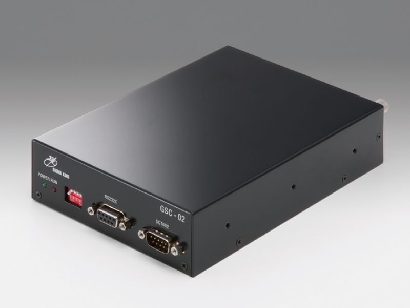

# GSC-02

## Controller
- OptoSigma, 2 axis Stage Controller (GSC-02) [[Web]](https://jp.optosigma.com/en_jp/gsc-02.html) [[Manual]](https://jp.optosigma.com/html/en_jp/software/motorize/manual_en/GSC-02.pdf)




## Usage
### Initialize Connection
```python
from optosigma import GSC02
port = "/dev/tty.usbserial-FTRWB1RN"
controller = GSC02(port)
```
### Reset
Return to mechanical origin.
```python
controller.return_origin("-", axis=1)
controller.sleep_until_stop()
```

### Set and Get Stage Position
Member variables `position1` and `position2` are linked to the position of the stage.
```python
print(controller.position1)  # Get stage position of axis 1
print(controller.position2)  # Get stage position of axis 2

controller.position1 = 500    # Move position to 500 of axis 1
controller.position2 = 200    # Move position to 500 of axis 2
controller.sleep_until_stop()

controller.position1 += 1000   # Move stage to +1000 [pulse] from current position of axis 1
controller.position2 -= 100   # Move stage to -100 [pulse] from current position of axis 2
controller.sleep_until_stop()
```

## Relationship Between Commands and Methods
| Command | Character | Methods |
| --- | ---| --- | 
| Return to mechanical origin | H: | return_origin(direction, axis) |
| Set number of pulses for  relative movement | M: | set_relative_pulse(pulse, axis) |
| Jog command | J: | jog(direction, axis) |
| Drive command | G | driving() |
| Stop command | L: | decelerate_stop(axis) |
| Set electronic (logical) origin | R: | set_logical_zero(axis) |
| Speed settings | D: | set_speed(spd_range, spd_min spd_max, acceleration_time) |
| Free motor | C: | energize_motor(energize, axis) |
| Status1 | Q: | get_status1() |
| Status2 | !: | get_status2() |
| Internal information | ?: | get_version() |