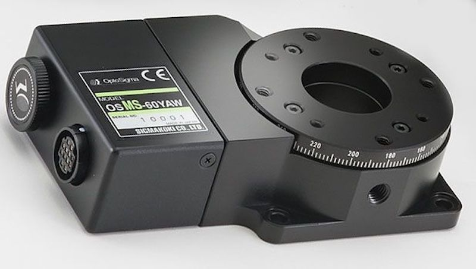

# OSMS-60YAW

## Stage and Controller
- OptoSigma, Rotation Motorized Stages (OSMS-60YAW) [[Web]](https://jp.optosigma.com/en_jp/osms-60yaw.html)
- OptoSigma, 2 axis Stage Controller (GSC-02) [[Web]](https://jp.optosigma.com/en_jp/gsc-02.html) [[Manual]](https://jp.optosigma.com/html/en_jp/software/motorize/manual_en/GSC-02.pdf)




## Usage
### Initialize Connection
```python
from optosigma import OSMS60YAW
port = "/dev/tty.usbserial-FTRWB1RN"
polarizer = OSMS60YAW(port)
```

### Reset
Return to mechanical origin.
```python
polarizer.reset()
```

### Set and Get Stage Angle
Member variable `degree` is linked to the angle of the rotation stage.
```python
print(polarizer.degree)  # Get stage angle
polarizer.degree = 90    # Rotate stage to 90 [deg]
polarizer.degree += 60   # Rotate stage to +60 [deg] from current position
```

### Run Any Process While the Stage Is Moving
By default, the methods that move stage (*i.e.*, `reset()` and `degree`) sleep until the stage is stopped. If you want to run another code while moving stage, you can disable the sleep process by setting member variable `is_sleep_until_stop` to `False`.
```python
polarizer.is_sleep_until_stop = False  # Disble the automatic sleep process
polarizer.degree += 180  # Start moving and go to the next process without the wait for the stage to stop
"""Run any process"""
polarizer.sleep_until_stop()  # Sleep until the stage is stopped
```